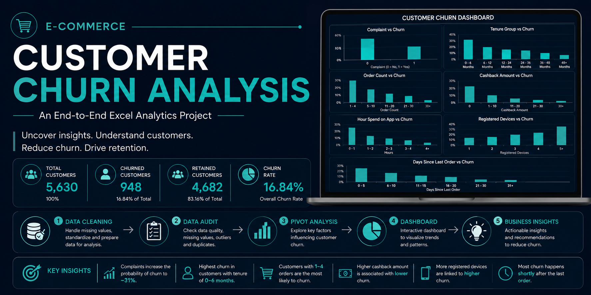

# E-Commerce-Customer-Churn-Analysis

  

End-to-end Excel project analyzing customer churn using data cleaning, pivot tables, dashboards, and business insights.

## 📑 Table of Contents

- [📌 Project Overview](#-project-overview)
- [🎯 Business Problem](#-business-problem)
- [📂 Dataset Overview](#-dataset-overview)
- [🧹 Data Cleaning](#-data-cleaning)
- [📋 Data Audit](#-data-audit)
- [❓ Business Questions](#-business-questions)
- [📊 Pivot Analysis](#-pivot-analysis)
- [📈 Dashboard](#-dashboard)
- [💡 Key Insights](#-key-insights)
- [🚀 Business Recommendations](#-business-recommendations)
- [🛠️ Tools Used](#-tools-used)
- [👨‍💻 Author](#-author)

## 📌 Project Overview
## 🎯 Business Problem
## 📂 Dataset Overview
## 🧹 Data Cleaning
## 📋 Data Audit
## ❓ Business Questions
## 📊 Pivot Analysis
## 📈 Dashboard
## 💡 Key Insights
## 🚀 Business Recommendations
## 🛠️ Tools Used
## 👨‍💻 Author
